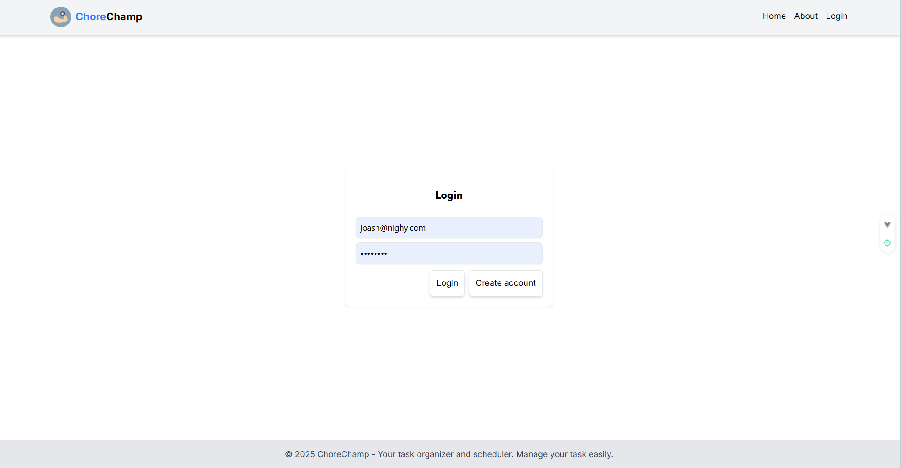

# ChoreChamp - Task Management Website

ChoreChamp is my examination for the position of software developer in VIPTutors. Although I did not finish it, I am very sure that I did my best and put all my hardwork, effort, dedication to this simple project. 
The frontend is made by VueJs (No frameworks like Nuxt just Vue). The backend is Laravel 12. I made sure that I used session based cookie for authentication to consider the CSRF and XSS attacks. I also create a route guard 
for the frontend to prevent auth/guest users accessing exclusive pages. I used MySQL Workbench as my way for storing data. I did not query inside the workbench to modify schema, so I can say that the migration files are enough to recreate the database. 

The application can drag and drop the tasks and can change the order in the database. It has a top color to determine wether a task is completed or not. A star indicates how urgent the task is.
If the star is green, it is low, yellow, medium, while red indicate high. When you click the task, a modal will popup to show the not so detailed view of task. Within the modal, you can make a task complete.

The task can be filtered as well. The search bar is working for direct query.
---

## Table of Contents
- [Installation](#installation)
- [Folder Structure](#folder-structure)
- [Screenshots](#screenshots)
  - [Login](#login)
  - [Registration](#registration)
  - [Homepage](#homepage)
  - [Admin Dashboard](#admin-dashboard)
- [Usage](#usage)
- [License](#license)

---

## Installation

### Backend
1. go to backend "cd backend" and type npm install and composer install
2. setup the .env file by copying it or making new one. Make sure to modify the database section.
3. run php artisan serve for backend service

### Frontend
1. on the same root folder, run "cd frontend" and type npm install.
2. then run the npm run dev to serve the frontend

