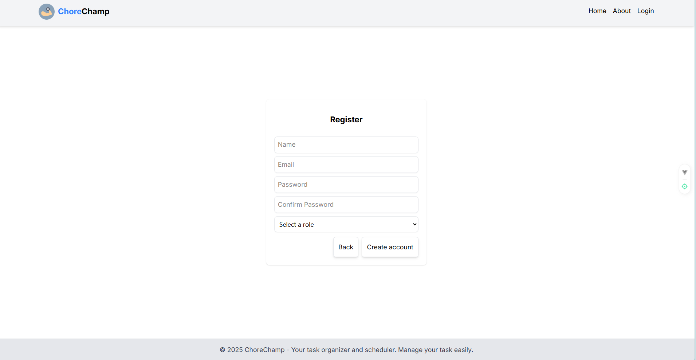
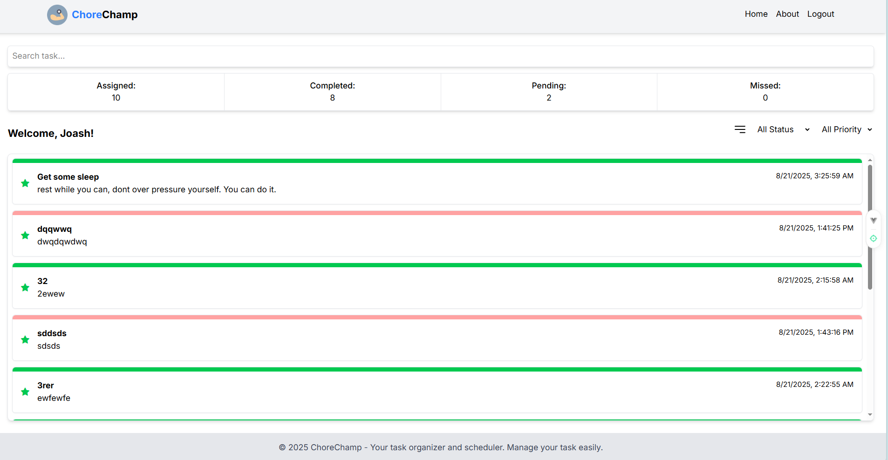
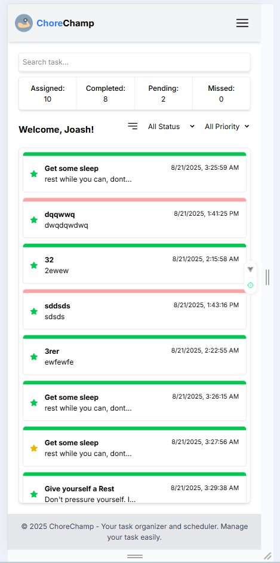
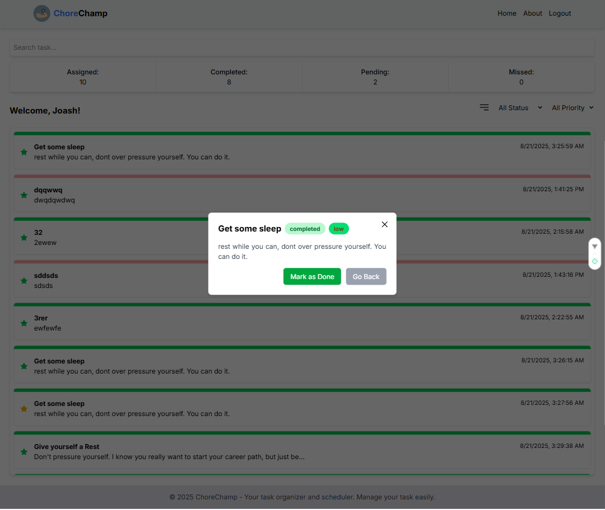
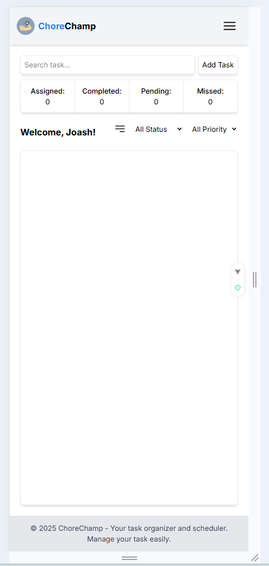

# ChoreChamp

ChoreChamp is a task management application created as part of my examination for the **Software Developer position at VIPTutors**. Although I did not fully complete it, I put my **best effort, dedication, and hard work** into this project.

---

## Tech Stack
- **Frontend:** Vue.js (Vanilla Vue, no frameworks like Nuxt)
- **Backend:** Laravel 12
- **Database:** MySQL (managed via MySQL Workbench)
- **Authentication:** Session-based cookies (CSRF & XSS protection included)
- **Routing:** Frontend route guards to prevent unauthorized access

---

## Features

### Task Management
- **Drag & Drop:** Tasks can be reordered, and changes are saved in the database.
- **Task Status:** The top color indicates completion status.
- **Urgency Indicator:** Tasks are starred with colors representing urgency:
  - 🟢 Low  
  - 🟡 Medium  
  - 🔴 High
- **Task Modal:** Click a task to open a modal with a brief view. Tasks can be marked as complete within the modal.

### Filtering & Search
- Tasks can be **filtered** by status and urgency.
- **Search bar** allows direct query for tasks.

---

## Database
- All tables are created via **Laravel migration files**, so the database can be recreated without manually modifying MySQL Workbench.

---
---

## Table of Contents
- [Installation](#installation)
- [Folder Structure](#folder-structure)
- [Screenshots](#screenshots)
  - [Login](#login)
  - [Registration](#registration)
  - [Homepage](#homepage)
  - [Admin Dashboard](#admin-dashboard)
- [Usage](#usage)
- [License](#license)

---

## Installation

### Backend
1. go to backend "cd backend" and type npm install and composer install
2. setup the .env file by copying it or making new one. Make sure to modify the database section.
3. run php artisan serve for backend service

### Frontend
1. on the same root folder, run "cd frontend" and type npm install.
2. then run the npm run dev to serve the frontend

The task order can be manipulate by dragging and droping. The record in the database will be updated.

To ensure adaptability in different width of devices, the layout is safe and not complex. Considering as well the UX/UI

The modal helps the user to focus on what they tap. 

On the admin side, the only difference is that it has 'Add Task' to distribute or give task to users.

You can add tasks, and select multiple existing users to assign it to them :D

